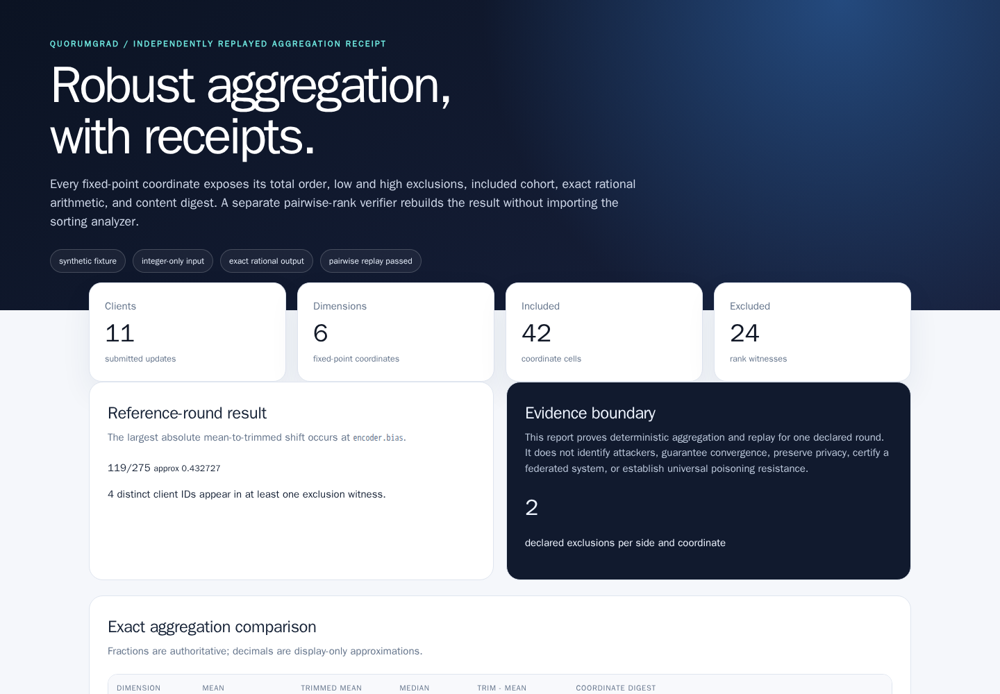
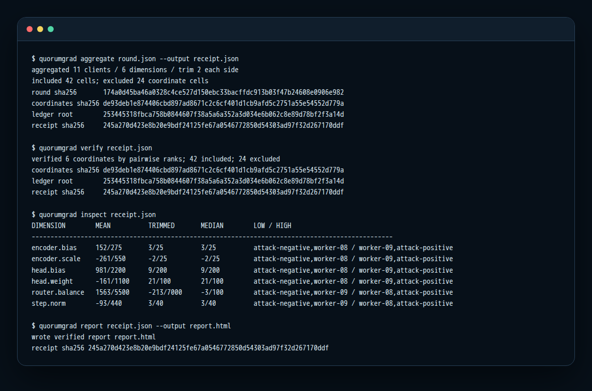
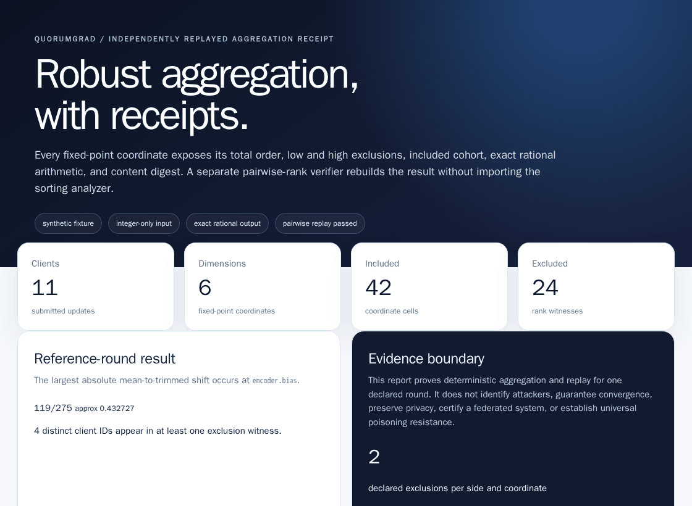

# QuorumGrad

<p align="center"><strong>Deterministic Byzantine-robust aggregation receipts with independent pairwise-rank replay.</strong></p>

<p align="center">
  <a href="https://github.com/omar07ibrahim/quorumgrad/actions/workflows/ci.yml"></a>
  <a href="https://github.com/omar07ibrahim/quorumgrad/actions/workflows/codeql.yml"></a>
  
  <a href="LICENSE"></a>
</p>



QuorumGrad is a zero-runtime-dependency Python laboratory for coordinate-wise trimmed-mean and median aggregation. It turns one bounded fixed-point client round into exact rank partitions, rational arithmetic, a hash-chain ledger, and a self-contained receipt. A deliberately different verifier reconstructs every rank with pairwise comparisons—without importing the sorting analyzer, engine, or ledger.

The result is not just an aggregate. It is a reviewable explanation of which coordinate cells were low, included, or high; how every fraction was computed; and whether the complete receipt replays byte-for-byte.

## Reference result

The checked-in synthetic sign-flip round produces:

| Contract | Exact result |
|---|---:|
| Clients × coordinates | 11 × 6 |
| Fixed-point update cells | 66 |
| Declared trim | 2 per side, per coordinate |
| Included / excluded cells | 42 / 24 |
| Distinct IDs in exclusion witnesses | 4 |
| Non-zero ordinary-to-trimmed mean shifts | 6 coordinates |
| Largest absolute shift | 119/275 at `encoder.bias` |
| Receipt ledger | 18 entries |
| Tests / line coverage | 88 / 96.57% |

These numbers describe one synthetic fixture. They are regression evidence, not an estimate of a production attack rate.


## Quick start

QuorumGrad supports CPython 3.11 through 3.14.

```bash
python -m pip install .
quorumgrad aggregate scenarios/sign-flip-round.json --output receipt.json
quorumgrad verify receipt.json
quorumgrad inspect receipt.json
quorumgrad report receipt.json --output report.html
```

The CLI refuses to replace an existing output file and creates receipt/report outputs with owner-only `0600` permissions. Inputs are bounded local JSON; the application makes no network requests.



The full [plain-text transcript](docs/evidence/quorumgrad-cli.txt), [receipt](docs/evidence/quorumgrad-receipt.json), and [self-contained HTML report](docs/evidence/quorumgrad-report.html) are tracked for review.

## Workflow



1. **Validate and normalize.** Require exact fields, unique IDs, bounded integers, 3–31 clients, 1–16 coordinates, and `2 × trim < clients`.
2. **Analyze.** Sort each coordinate by `(value_fixed, client_id)`, split the exact low/included/high witnesses, and compute reduced rational mean, trimmed mean, and median.
3. **Commit.** Hash the normalized round, every coordinate body, an append-only ledger, and the complete receipt with canonical JSON SHA-256.
4. **Replay independently.** Reconstruct each total order through O(n²) pairwise rank counts. The verifier contains no `sorted()` call and imports none of the analyzer, engine, or ledger modules.
5. **Render only after verification.** The HTML report verifies the receipt before displaying any field.

### Exact membership, not an opaque score


Ties are deterministic because the client ID is the secondary key. That makes membership reproducible while giving the ID no trust meaning.


Low and high membership is coordinate-specific. The algorithm never interprets fixture labels such as `attack-positive`; an exclusion witness is not an attacker verdict.

### Exact arithmetic, not floating-point drift


Inputs are fixed-point integers and outputs are reduced fractions. Decimal values in the report are display-only. The receipt and verifier compare the authoritative numerator/denominator pairs.

## Receipt anatomy

| Field | Purpose |
|---|---|
| `round` | Complete normalized fixed-point input |
| `round_sha256` | Canonical input commitment |
| `coordinates` | Ranked cells, partitions, arithmetic, and coordinate digests |
| `summary` | Exact bounded counts and maximum-shift witness |
| `ledger` | Hash chain over the round header, clients, and coordinates |
| `ledger_root_sha256` | Final append-only chain root |
| `receipt_sha256` | Commitment to every receipt field above |

Canonical JSON is UTF-8 with sorted keys and compact separators. Parsing rejects duplicate keys, non-finite numbers, invalid UTF-8, and oversized documents.

## What this proves—and what it does not

QuorumGrad proves that, for the declared round:

- the coordinate-wise ordering and trim membership are deterministic;
- the recorded rational arithmetic is exact;
- analyzer and pairwise-rank verifier agree on every public receipt field;
- mutations, omissions, extra fields, reordered material, and digest changes are rejected;
- the tracked visual bundle is reproducible from a declared source revision and pinned renderer.

It does **not** identify malicious clients, guarantee learning convergence, provide privacy or secure aggregation, validate the truth of submitted updates, certify a federated-learning deployment, or defeat every poisoning strategy.

Coordinate-wise median and trimmed mean are established robust distributed-learning techniques in [Yin et al., ICML 2018](https://proceedings.mlr.press/v80/yin18a.html). They are not universal defenses: [Xie et al., UAI 2020](https://proceedings.mlr.press/v115/xie20a.html) demonstrate attacks against Byzantine-tolerant SGD methods. [NIST AI 100-2e2025](https://doi.org/10.6028/NIST.AI.100-2e2025) places poisoning within a broader adversarial-ML risk taxonomy.

## Reproducible visual evidence

The [evidence lifecycle](docs/evidence.md) runs the installed CLI, verifies the receipt, and captures the real report in digest-pinned Chromium. Browser capture runs with networking disabled, a read-only source mount, dropped capabilities, no privilege escalation, and resource limits.

The manifest records:

- source revision and complete source tree;
- hashes for 20 declared source inputs;
- hashes, byte counts, dimensions, and media types for 12 artifacts;
- exact Python, browser, Playwright, Pillow, container image, filesystem, and network contracts.

See [`quorumgrad-evidence.json`](docs/evidence/quorumgrad-evidence.json). Generated evidence is never edited by hand.

## Engineering quality

- 88 deterministic tests and 96.57% line coverage;
- Ruff linting and formatting plus strict mypy;
- clean-wheel installation exercised outside the checkout;
- exact CPython 3.11.15, 3.12.13, 3.13.14, and 3.14.6 jobs;
- hash-locked quality and browser dependencies;
- digest-pinned GitHub Actions and browser container;
- CodeQL, Dependabot, secret scanning, and push protection;
- linear history and protected default branch.

Read [architecture and trust boundaries](docs/architecture.md), [security policy](SECURITY.md), and [contribution guide](CONTRIBUTING.md).

## Repository origin

This repository was an empty GitHub repository named `RDP` from 2021 until its transparent 2026 repurpose. The original zero-file state is preserved in [machine-readable provenance](PROVENANCE.md) and [legacy metadata](legacy/empty-rdp-2021/manifest.json).

## License and citation

Licensed under [Apache-2.0](LICENSE). Citation metadata is provided in [`CITATION.cff`](CITATION.cff).
