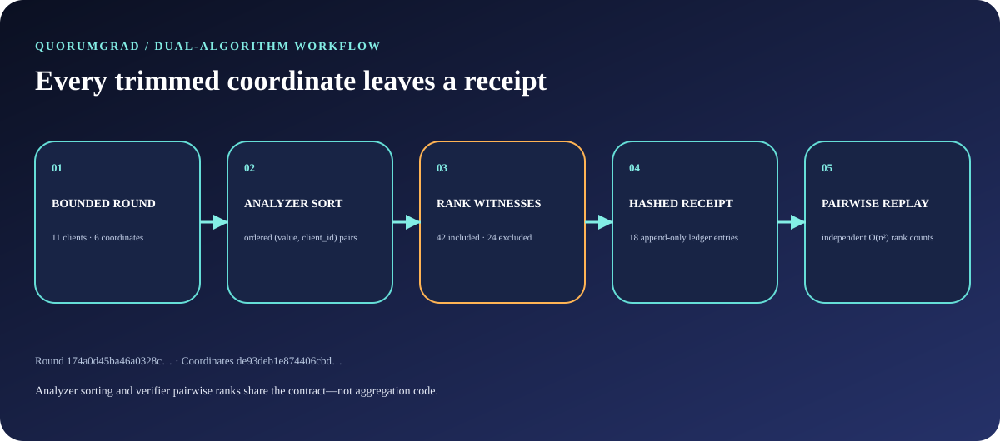
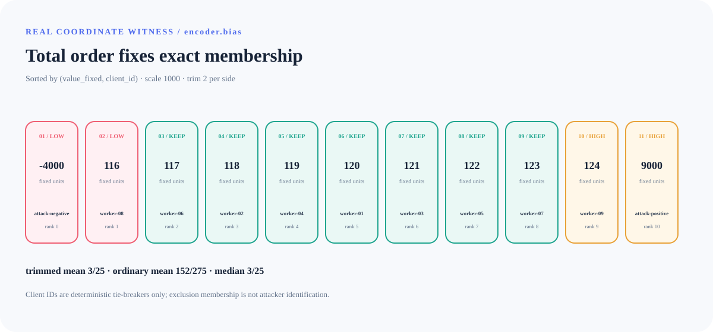
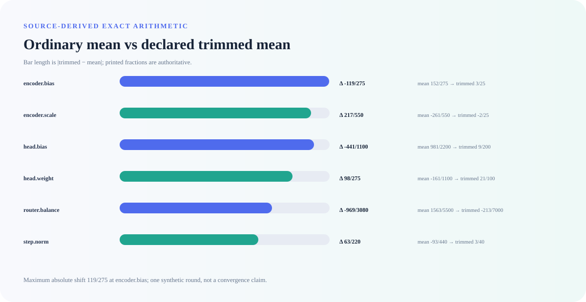
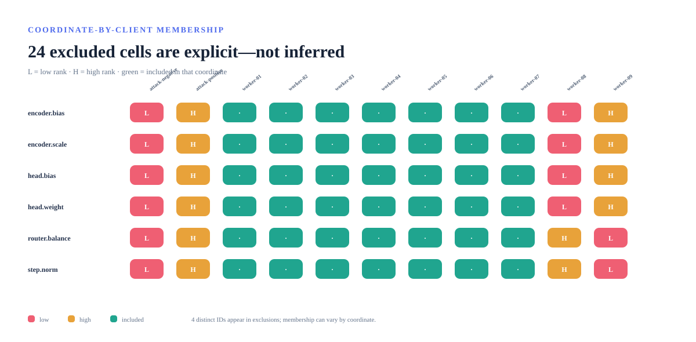

# Architecture and trust boundaries

QuorumGrad is a deliberately small adversarial-ML systems project: a dependency-free analyzer creates exact coordinate-wise aggregation receipts, while a structurally different verifier decides whether a receipt is internally trustworthy.



## System boundary

The trusted input is one bounded fixed-point aggregation round. It declares:

- a round ID, integer scale, and trim count;
- 1–16 unique coordinate names;
- 3–31 uniquely identified clients;
- one bounded integer update for every client-coordinate pair.

QuorumGrad does not contact clients, an orchestrator, model weights, a dataset, a feature store, or a network service. It cannot establish whether an update is honest, who generated it, or what effect the aggregate has on optimization. It evaluates only the declared round.

## Analyzer path

The analyzer processes each coordinate independently:

1. construct one `(value_fixed, client_id)` pair per client;
2. sort pairs lexicographically;
3. take exactly `trim` low and `trim` high witnesses;
4. retain the non-empty center;
5. compute the ordinary mean, center trimmed mean, and median as reduced fractions;
6. hash the complete coordinate body.

The client ID is a deterministic secondary key. It makes tie membership stable but carries no trust semantics.



## Independent verifier path

The verifier intentionally does not import `aggregate`, `engine`, or `ledger`, and it contains no `sorted()` call. For each coordinate it:

1. compares every pair of `(value_fixed, client_id)` values;
2. counts how many pairs precede each item;
3. places the item at that independently derived rank;
4. rebuilds partitions and exact rational arithmetic;
5. independently rebuilds the summary and hash chain;
6. reconstructs the receipt commitment and compares every field.

The analyzer is O(d × n log n); the verifier is deliberately O(d × n²), where n is clients and d is coordinates. With n ≤ 31 and d ≤ 16, the slower path remains explicitly bounded and provides algorithmic diversity.

## Exact arithmetic

All public arithmetic is represented as:

```json
{"numerator": 3, "denominator": 25}
```

Ratios are reduced by the greatest common divisor and denominators are positive. No floating-point value participates in aggregation, verification, canonicalization, or hashing.



## Receipt model

A receipt contains:

| Field | Purpose |
|---|---|
| `round` | Normalized complete input |
| `round_sha256` | Canonical round commitment |
| `coordinates` | Total orders, partitions, exact arithmetic, and coordinate hashes |
| `summary` | Bounded counts and maximum-shift witness |
| `ledger` | Round header + n clients + d coordinate bodies |
| `ledger_root_sha256` | Final hash-chain entry |
| `receipt_sha256` | Commitment to the complete receipt core |

The reference fixture produces 18 ledger entries: one header, 11 clients, and 6 coordinates.

Canonical JSON uses sorted keys, UTF-8, compact separators, and finite values. The bounded parser rejects duplicate keys before they can collapse into an ambiguous object.

## Threat model

QuorumGrad is designed to detect and reject:

- malformed, oversized, duplicate-key, non-finite, or non-UTF-8 JSON;
- missing, extra, reordered, or mutated receipt material;
- incorrect rank partitions, arithmetic, coordinate hashes, ledger links, or top-level digests;
- nondeterministic tie membership or client input ordering;
- implicit overwrite of existing CLI outputs;
- visual evidence drift from source, fixture, renderer, or toolchain changes;
- credential-like markers and machine-specific paths in tracked text evidence.

It does not protect against a malicious Python interpreter, compromised CI runner, falsified updates, colluding clients within or outside the declared trim model, side channels, a repository administrator rewriting history, or downstream misuse of the aggregate.



## Evidence supply chain

The evidence workflow separates application execution from browser rendering:

1. CPython 3.14.6 installs the hash-locked quality environment and package.
2. The installed CLI aggregates and independently verifies the real synthetic round.
3. CPython 3.12.3 downloads five hash-locked browser wheels.
4. A digest-pinned linux/amd64 Playwright image runs Chromium with no network, a read-only source mount, dropped capabilities, resource limits, and no privilege escalation.
5. CPython 3.14.6 finalizes the manifest and independently replays the candidate bundle.
6. Evidence drift is synchronized only on a same-repository pull request and committed as Omar Ibrahim.

The manifest’s `source_revision` is the latest commit that changed an evidence input; `source_tree` binds that commit’s complete tree. Per-file SHA-256 records make the narrower dependency set explicit.

## Design trade-offs

**Coordinate-wise estimator.** The implementation is inspectable and produces simple per-coordinate witnesses, but it does not model correlations across coordinates.

**Complete embedded input.** Receipts are self-contained and replayable, at the cost of duplicating the bounded round.

**Pairwise verifier.** O(n²) replay is slower than sorting but avoids sharing the analyzer’s ranking operation.

**Fixed-point contract.** Integers and fractions eliminate floating-point ambiguity, but callers must choose an appropriate scale and quantization policy outside this repository.

**No attacker labels.** The algorithm reports membership and arithmetic only. This avoids overstating what rank exclusion can establish.
